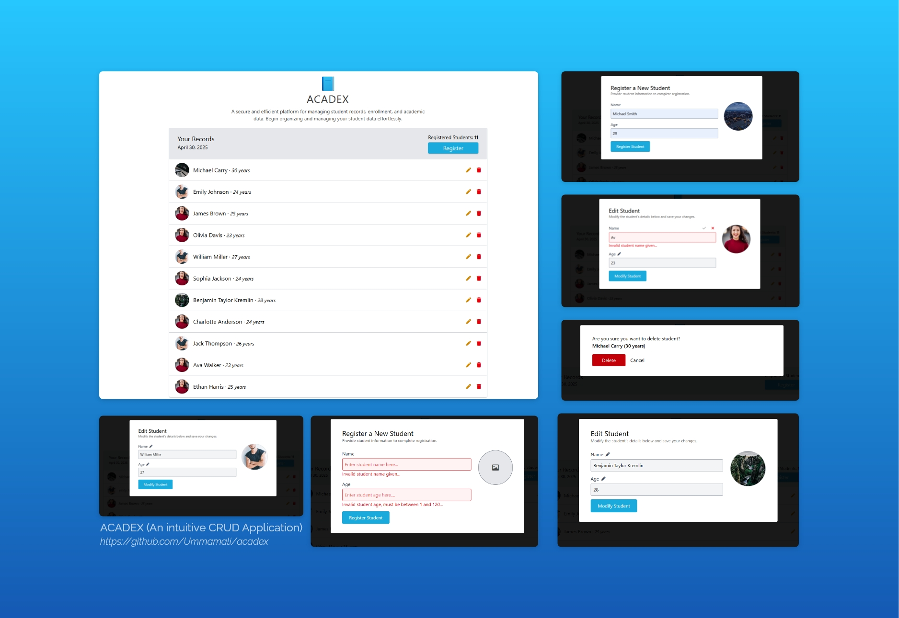

# Acadex — A Clean and Intuitive CRUD Application

Acadex is a web-based CRUD application designed to help you manage student records efficiently. It features a clean and intuitive user interface for performing essential operations like creating, reading, updating, and deleting student data. The frontend is seamlessly integrated with a backend server built using Express.js on Node.js, ensuring fast and responsive interactions. Unlike traditional database-driven apps, Acadex uses a lightweight flat file database to store student information, making it ideal for small projects, demos, or educational purposes. Whether you're learning full-stack development or need a quick solution for managing student data, Acadex offers a practical, minimalistic approach.



## Features ✨

- **Create, Read, Update, Delete (CRUD)**  
  Manage student records with full CRUD functionality through an intuitive interface.

- **Form Validation**  
  Ensures that all required fields are filled correctly before submission, preventing incomplete or invalid data.

- **User Feedback Alerts**  
  Displays success, error, and informational messages to keep users informed about their actions.

- **Loading States & Error Handling**  
  Shows loading indicators during data operations and provides clear error messages when something goes wrong.

- **Profile Image Upload**  
  Allows users to change and upload a profile picture for each student record.

- **Modals for Actions**  
  Uses modal windows for creating, editing, and deleting student entries, keeping the experience focused and clean.

- **Responsive Design**  
  Fully responsive layout that works seamlessly across desktops, tablets, and mobile devices.

## Installation  

Follow these steps to set up and run the Project Manager app locally (Make sure you have Node.js and npm installed before running the commands):  

1. **Clone the repository:**  

    ```sh
   git clone https://github.com/Ummamali/acadex.git
   cd acadex

3. **Install dependencies:**

      ```sh
    npm install
    
4. **Start the development server:**

     ```sh
     npm run dev

## Technologies Used ⚙️

- **HTML5** – HTML5 is the foundation of the app's structure, providing the semantic layout and supporting multimedia elements. It ensures that the content is accessible and well-organized across all modern browsers.
  
- **CSS3** – CSS3 is used for styling the app, creating a visually appealing design with modern features like flexbox, animations, and responsive layouts. It enhances the user experience by ensuring that the interface is aesthetically pleasing.

- **JavaScript** – JavaScript is the primary programming language driving the functionality of the app, handling user interactions, and managing dynamic content. It powers the quiz logic, including question navigation and score calculation.

- **React** – React is used to build the app’s user interface with reusable components, allowing for a dynamic and responsive experience. Its virtual DOM ensures optimal performance by efficiently updating the UI when the state changes.

- **Vite** – Vite is a next-generation build tool that is used to bundle the app. It provides fast development with features like hot module replacement (HMR), making the development process faster and more efficient.

- **TailwindCSS** – TailwindCSS is a utility-first CSS framework used to create custom, responsive designs quickly. It simplifies the styling process by providing a wide range of pre-built classes that can be combined to create any layout.

- **Node.js** – Node.js allows the backend of the app to handle server-side logic and file parsing. It enables the app to process quiz files, manage requests, and serve dynamic content efficiently.

- **Git** – Git is a version control system that tracks code changes, facilitates collaboration, and ensures that developers can work on different parts of the project without conflicts. It is essential for maintaining a smooth development workflow.

## License  

This project is licensed under the **MIT License**. For more details, visit [MIT License](https://opensource.org/licenses/MIT).  
